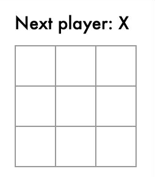

# minimax
A tictactoe game with an ai opponent. Base starter code tutorial for tic-tac-toe grid was from https://reactjs.org/tutorial/tutorial.html and I added a computer AI player. 
Computer player implemented using minimax algorithm, which calculates its best possible move for each of its turns. 


## installation
```
git clone https://github.com/jennyzhang7/minimax.git
npm install
npm start
```

## Sample game
Computer: O
Player: X

  


Future improvements:
- add multiplayer functionality (using Firebase?)
- improve page design